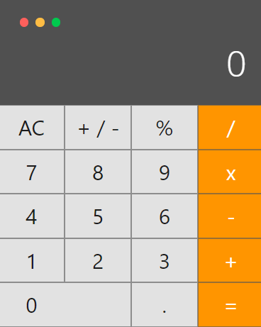

# Vue Mac Calculator
A simple macOS calculator made in VueJS.  
Check it out: https://vuecalc.cf, or alternatively [Vue Mac Calculator](https://vue-calc-3000.web.app/).

### Note: After testing Github actions a lot by tweaking everything in this calc, the layout is somehow skewed, not like the original. The screenshot of the original look is given below  



## Project setup
```
npm install
```

### Compiles and hot-reloads for development
```
npm run serve
```

### Compiles and minifies for production
```
npm run build
```

### Lints and fixes files
```
npm run lint
```

### Customize configuration
See [Configuration Reference](https://cli.vuejs.org/config/).
